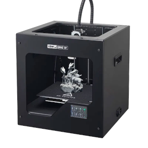
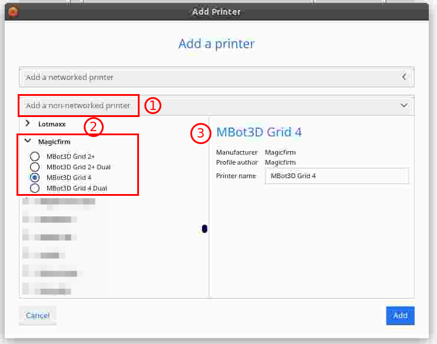
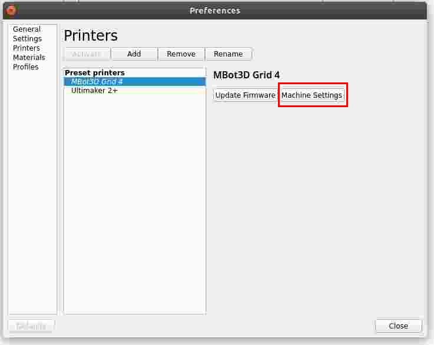
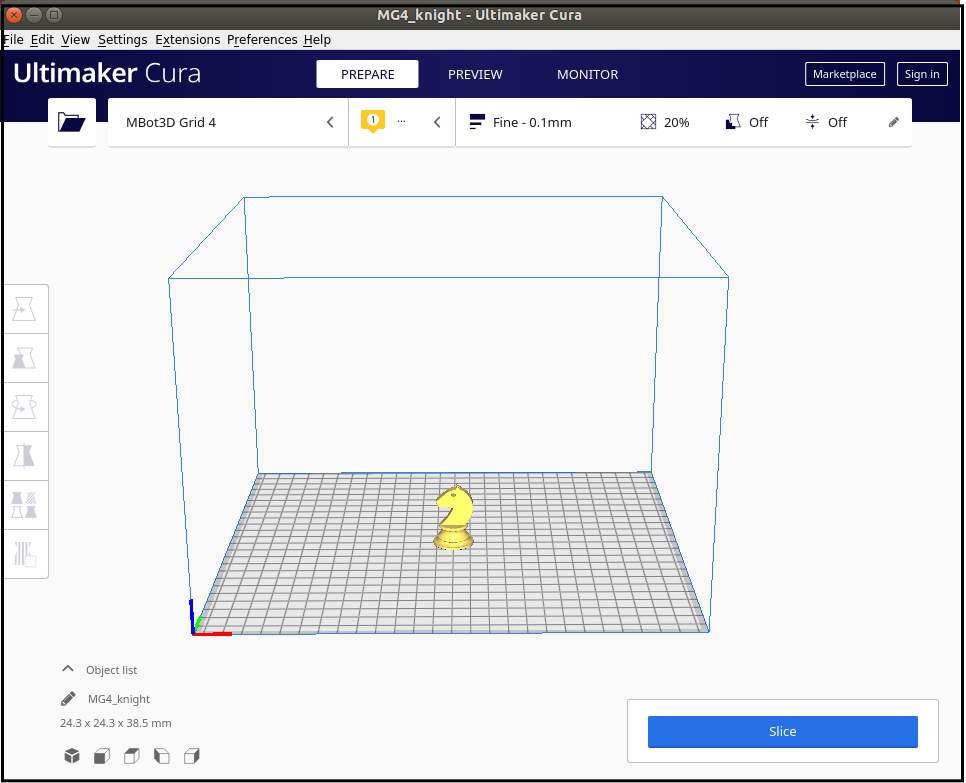
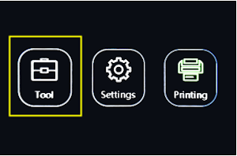
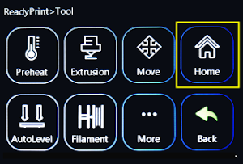

name: default-page
layout: true
background-image: url("fablabsp_icon_100px.png")
background-position: 98% 2%

---

class: center, middle

# 3D Printing with 
MBot3D Grid 4

---

template: default-page
layout: false

# MBot Grid IV

.left-column-50[

]

.right-column-50[

The MBot Grid IV is a personal desktop 3D printer, purchased in 2019.

However, it is believed that

- this is the first version
- the firmware is .highlight[customised] and may be different from Internet liste models
- We have .highlight[bad] results from prints
- [Official Site](https://www.mbot3d.com/product-3d-printer/mbot-grid4)

Printing

- Although the MBot has its own proprietary slicer, [MPrint 2.0](https://www.mbot3d.com/software), this presentation shows how to print using the [Cura](https://ultimaker.com/software/ultimaker-cura) slicer.

]

---
template: default-page
layout: false

# Installation

&nbsp;

.left-column-50[

]

.right-column-50[

Add MBot to the Printer list

1. Install [Ultimaker Cura](https://ultimaker.com/software/ultimaker-cura) and run.
2. Top Menu > Settings > Printer > Add Printer
3. Add a .highlight[Non-networked Printer]
4. Select the .highlight[Magic Firm] group
5. Select .highlight[MBot Grid 4]
]

---
template: default-page
layout: false

# Configure Printer Settings

&nbsp;

.left-column-50[

]

.right-column-50[

Make changes to the default printer settings:

1. Top Menu > Settings > Manage Printers
2. Select the MBot Grid IV printer
]

---
template: default-page
layout: false

# Preparation for Slicing

You can now slice your object

- Select the MBot Grid IV printer
- Load the STL file
- Make necessary adjustments to the object
- Slice
- Save to Removable Drive (usually .highlight[Thumbdrive])

---
template: default-page
layout: false

# Print Your Model

&nbsp;

.left-column-50[
 
Boot Menu 
 
Tool Menu
]

.right-column-50[

Steps to print

- Load the thumbdrive
- On the MBot Boot Menu
    - select HOME
    - Home ALL the axes.
    - You need to home the printer before any printing can be started!
- Select PRINTING, locate file to print
-  Print.

]

---
class: center, middle

# EP1000 Documentation

### .red[End]

