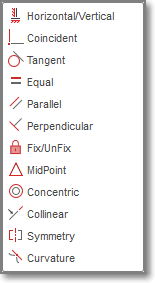

name: default-page
layout: true
background-image: url("fablabsp_icon_100px.png")
background-position: 98% 2%

---

class: center, middle

# EP1000 3D Model

---
name: 3D Model
template: default-page
layout: false
# 3D Model

## Methods of creating 3D Models in Fusion 360

### Extrusion

- Use a 2D plane profile
- Extend into the 3rd plane

### Rotation

- Use a 2D plane profile
- Rotate the plane around an axis

### Sculpting

- Start with a 3D object
- Add, remove 3D objects
- Subdivide the surface into sections
- Push, pull, extend, contract sections

<!-- /3D Model -->

---
name: Essential Tools in Fusion 360
template: default-page
layout: false
# Essential Tools in Fusion 360

From AutoDesk Training

- [Introduction to Fusion 360](https://help.autodesk.com/view/fusion360/ENU/courses/AP-GET-STARTED-OVERVIEW)
- [User Interface Overview](https://help.autodesk.com/view/fusion360/ENU/courses/AP-USER-INTERFACE-OVERVIEW)
- [Open, close, export, upload, and save designs](https://help.autodesk.com/view/fusion360/ENU/courses/AP-OPEN-CLOSE-EXPORT-UPLOAD-SAVE)
- [Set Preferences](https://help.autodesk.com/view/fusion360/ENU/courses/AP-OPEN-CLOSE-EXPORT-UPLOAD-SAVE)
- [Adjust Display settings](https://help.autodesk.com/view/fusion360/ENU/courses/AP-ADJUST-DISPLAY-SETTINGS)
- [Use the Marking Menu](https://help.autodesk.com/view/fusion360/ENU/courses/AP-MARKING-MENU)
- [Use the Toolbox](https://help.autodesk.com/view/fusion360/ENU/courses/AP-TOOLBOX)
- [Create A Project](https://help.autodesk.com/view/fusion360/ENU/courses/AP-CREATE-PROJECT)
- [Open a Design created in another CAD system](https://help.autodesk.com/view/fusion360/ENU/courses/AP-IMPORT-EXPORT)
- [Components and Bodies](https://help.autodesk.com/view/fusion360/ENU/courses/AP-BODIES-COMPONENTS)
- [Parametric vs. direct modeling](https://help.autodesk.com/view/fusion360/ENU/courses/AP-CAPTURE-HISTORY)
- [Working with Design versions](https://help.autodesk.com/view/fusion360/ENU/courses/AP-FILE-VERSION)
- [Sketch Constraints](https://youtu.be/J_2If5zVp84)

<!-- /Essential Tools in Fusion 360 -->

---
name: Fast Track for Engineers
template: default-page
layout: false
# Fast Track for Engineers

Kevin Kennedy: [Product Design Online](https://productdesignonline.com/)

- [Learn Fusion 360 in 30 days](https://productdesignonline.com/fusion-360/)

### Highlighted topics

- 
[Navigating the Fusion 360 User Interface (sections explained) - REVISED 2019](https://youtu.be/sZwM87-nsYA)  -  [site text](https://productdesignonline.com/fusion-360-tutorials/learn-the-fusion-360-user-interface/)
- [Default settings for Fusion 360](https://productdesignonline.com/default-settings-for-fusion-360-tutorials/)  -  [site text](https://productdesignonline.com/tips-and-tricks/understanding-bodies-and-components-fusion-360-rule-1/)
- [How to Manually Add Sketch Constraints - Learn Autodesk Fusion 360 in 30 Days: Day #16](https://youtu.be/BGwBZJ14KHQ)
- [How to Create text in Fusion 360](https://youtu.be/BkpAtMAHtyQ)
- [How and Why to Fully Constrain Your Sketches](https://youtu.be/C11L136U0vQ)

<!-- /Fast Track for Engineers -->

---
name: F360 Building Blocks
template: default-page
layout: false
# F360 Building Blocks

.left-column-50[### Sketch

- Created in a 2D plane
- Sketches should be constrained and closed
- Forms the building block of all models

### Body

- Usually created from a sketch(s)
- Is a .highlight[SOLID]
- Can combine to form other bodies

### Component

- Made up of bodies and sketches
- Usually "joined" or "combined"
- Can be used to form other components
]

.right-column-50[]

<!-- /F360 Building Blocks -->

---
name: Constraints
template: default-page
layout: false
# Constraints

## Why constrain a sketch?

- A .highlight[constrained] sketch cannot be changed (accidentally).
- Each segment is locked by a dimension or a constraint.
- Constrained segments are drawn in .blue[blue].

.left-column-60[### Types of constraints

- Dimension
- Horizontal, Vertical
- Coincident (constrains a point to another point, line, arc, or curve.)
- Tangent
- Equal
- Parallel
- Perpendicular
- Fix / UnFix
- MidPoint
- Concentric
- Colinear ( constrains a line to another line, so that both lines fall onto the same line)
- Symmetry
- Curvature
]

.right-column-40[]

<!-- /Constraints -->

---
name: Saving Designs
template: default-page
layout: false
# Saving Designs

### Fusion 360 saves all files into the cloud

- You can share your files within the cloud
- You can export your design file to the local storage using .highlight[export].
- Output format is .f3d

<!-- /Saving Designs -->

---
name: Parametric Design
template: default-page
layout: false
# Parametric Design

- Enter variables as parameters
- Use parameters in your design
- Design becomes very flexible

<!-- /Parametric Design -->

---
name: Parametric Polygon
template: default-page
layout: false
# Parametric Polygon

- A fully configurable polygon with parametric sides and size.

.footnote[Design file: [parametric_polygon.f3d](parametric_polygon.f3d)]

<!-- /Parametric Polygon -->

---
name: Extrusion Join
template: default-page
layout: false
# Extrusion Join

You can build new bodies by .highlight[adding] to the original.

<!-- /Extrusion Join -->

---
name: Extrusion Cut
template: default-page
layout: false
# Extrusion Cut

You can cut holes using .highlight[subtraction] to the original.

.footnote[Lots of Video Tutorials on YouTube]
<!-- /Extrusion Join -->

---
name: Name Tag
template: default-page
layout: false
# Name Tag

Let's make a name tag

- dimensions: 30mm x 70mm x 4 mm 
- rim of 1.5mm thickness around the edges, height 2.5mm
- key-ring hole of 4mm, re-enforced with 1.5mm rim
- name or design/pattern 0.5mm below surface
- base of name tag 1.5mm thick

.footnote[[nametag.f3d](nametag.f3d)]
<!-- /Name Tag -->

---
name: Fidget Spinner
template: default-page
layout: false
# Fidget Spinner

A common toy to make is a fidget spinner, which demonstrates the following skills
- Sketching, dimensioning, patterns (circular)
- Extrusion
- Finishing

Use the following dimensions:

<!-- /Fidget Spinner -->

---
class: center, middle

# EP1000 3D Model

### .red[End]

