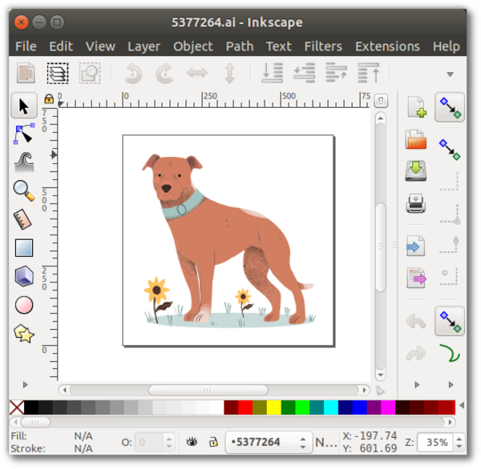

name: default-page
layout: true
background-image: url("fablabsp_icon_100px.png")
background-position: 98% 2%

---

class: center, middle

# EP1000 CAD

---
name: Computer Graphics
template: default-page
layout: false
# Computer Graphics

Divided into 2 categories

.left-column-50[### Raster

- deals with pixels on the screen
- used for photographs, images
- formats: .jpg, .png 
- <a href="raster_zoomed_in.png" target="_blank">Raster Zoomed In</a>

]

.right-column-50[### Vector

- uses mathematical functions
- characteriszed by clean lines
- formats: .dxf, .svg. STEP
- <a href="vector_zoomed_in.png" target="_blank">Vector Zoomed In</a>
- <a href="dog_vector.ai">Dog Vector Image (AI)</a>

]

<!-- /Computer Graphics -->

---
name: Raster Graphics
template: default-page
layout: false
# Raster Graphics

- Software: [GIMP](https://gimp.org/), Adobe PhotoShop, Paint
- Allows creation, editing of images (photographs)
- Common formats .jpg, .png

## Task

- Choose one your your selfies
- Remove the background of the image
- Substitute with a seaside scene
- Resize to a width of 1024 pixels
- Document your work in your project blog

Ref: [GIMP: Remove The Background And Make It Transparent](https://youtu.be/C0tg2mRroSY)

<!-- /Raster Graphics -->

---
name: Vector Graphics
template: default-page
layout: false
# Vector Graphics

- Software: [InkScape](), Adobe Illustrator, Corel Draw
- Allows creation of vector art
- Common formats .svg, .ai

## Task

- Choose an image of an animal
- Trace the outline of the image to form a vector art
- Create a B/W logo with your vector art
- Document your work in your project blog

Ref: [Inkscape Tutorial: Vector Image Trace](https://youtu.be/s-kPg4vYKfk)

<!-- /Vector Graphics -->

---
name: Computer Aided Design
template: default-page
layout: false
# Computer Aided Design

- Vector tools that allow you to 
  - create your design
  - draw and model
  - simulate and test
  - analyze the results
- We will mainly use the tool to .highlight[Draw] and .highlight[Model] the design
- Extract digital information for fabrication
- CADD Tools
  - Autodesk Fusion 360
  - Autodesk Inventor
  - Rhino
  - Solidworks

<!-- /Computer Aided Design -->

---
name: Autodesk Fusion 360
template: default-page
layout: false
# Autodesk Fusion 360

- An integrated CAD, CAM and CAE software.
- Can consolidate your product development process.
- Provided .highlight[free] for educationsl use (requires registration)
- Easy to learn and master, with lots of online tutorials

<!-- /Autodesk Fusion 360 -->

---
name: Getting Started
template: default-page
layout: false
# Getting Started

- Register and Install Fusion 360 on your system.
- Here are some good tutorials to get you started:
  - Autodesk: [Getting Started With Fusion 360](https://help.autodesk.com/view/fusion360/ENU/courses/)
  - Kevin Kennedy - [Product Design Online](https://productdesignonline.com/fusion-360/)
    - [Fusion 360 Interface](https://www.youtube.com/watch?v=sZwM87-nsYA)
    - [Fusion 360 for Beginners](https://youtu.be/J39Iq4Kku1Q?list=PLrZ2zKOtC_-DR2ZkMaK3YthYLErPxCnT-)
  - Warwick University [Fusion 360 Tutorials](https://warwick.ac.uk/fac/sci/wmg/about/outreach/resources/fusion_tutorials/)

### Exercises

- Complete exercise 1 and 2
- Export your completed files (.f3d) and include them in your report

<!-- /Getting Started -->

---
name: Drawing Exercise 1
template: default-page
layout: false
# Drawing Exercise 1

<!-- /Drawing Assignment 1 -->

---
name: Drawing Exercise 2
template: default-page
layout: false
# Drawing Exercise 1

- [Worked Example](https://youtu.be/A9DpjtKvEVo)

<!-- /Drawing Assignment 1 -->
---
class: center, middle

# EP1000 CAD

### .red[End]

