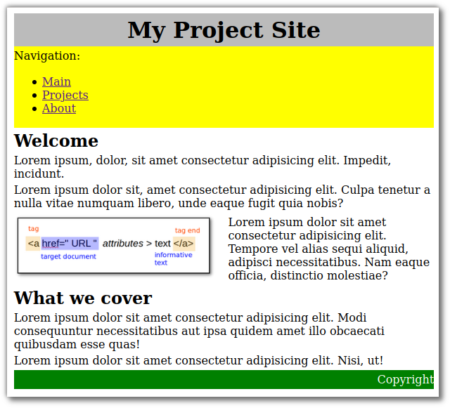
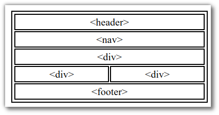
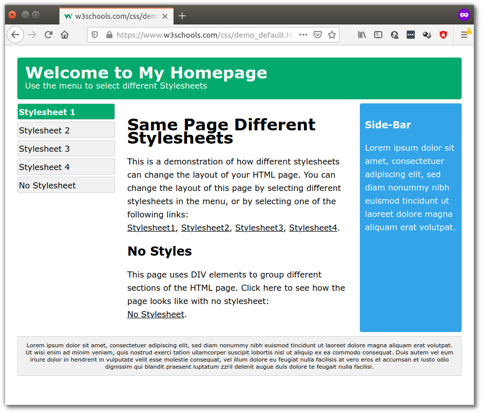
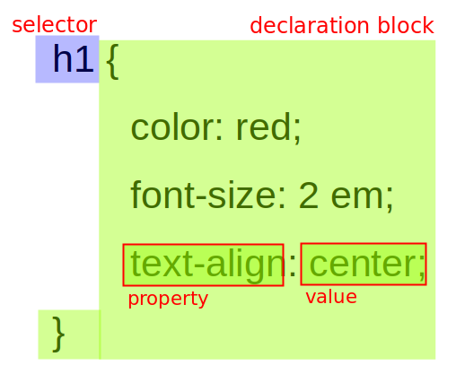
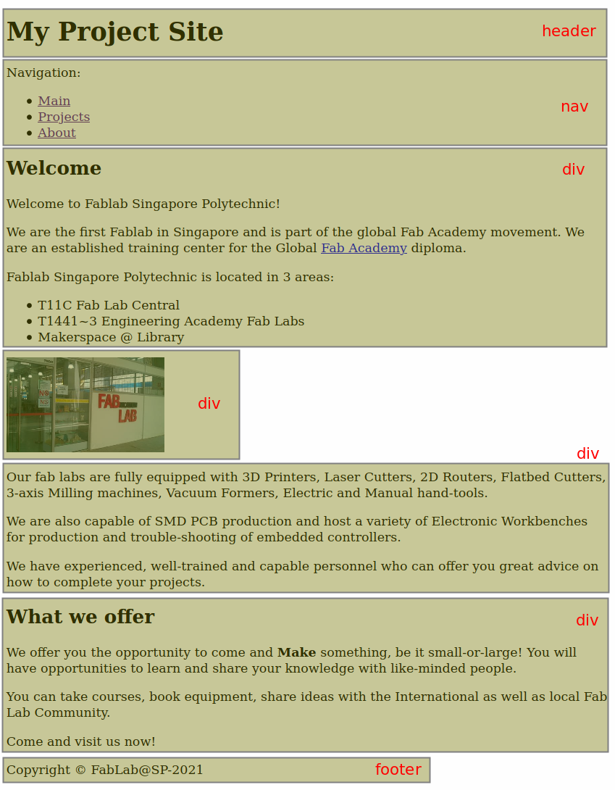
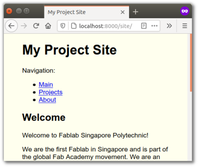
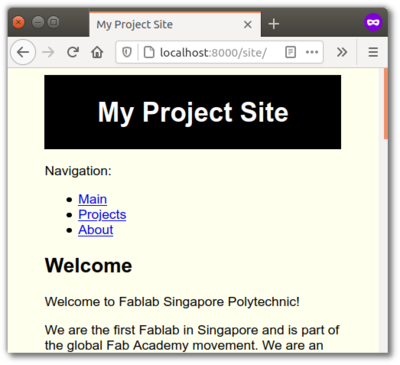

name: default-page
layout: true
background-image: url("fablabsp_icon_100px.png")
background-position: 98% 2%

---

class: center, middle

# EP1000<br>CSS

---
template: default-page
layout: false

# (more) HTML

- Before we can get to CSS, we need to cover a little more HTML

## Review

- HTML is for .highlight[CONTENT]

- CSS is for .highlight[LAYOUT]

Often we "break-up" a page into sections

 - easier management
 - generating a template
 - duplicating pages, changing only relevant sections

---
template: default-page
layout: false

# The Head Element

- the HTML &lt;head&gt; element is a container for 
  - &lt;title&gt;
  - &lt;link&gt;
  - &lt;style&gt;
  - &lt;script&gt;
  - &lt;meta&gt;
- contains .highlight[metadata] (data about the HTML document)
- Metadata is not displayed.

---
template: default-page
layout: false

# The Head Element (contd)

## &lt;title&gt;

- text which is displayed on the browser's bar or page's tab
- .highlight[required] in HTML documents
- purpose
  - defines a title in the browser's toolbar
  - provides a title for the page when added to favorites
  - displays a title for page in search engine results.


### &lt;link&gt;

- defines the relationship between current document and an external resource.
- most often used to link external style sheets

```html
<link rel="stylesheet" href="mystyles.css"
```

---
template: default-page
layout: false

# The Head Element (contd)

## &lt;style&gt;

- used to define style information for a .highlight[SINGLE] HTML page.


## &lt;script&gt;

- used to define client-side Javascripts


## &lt;meta&gt;

- used to provide information about the page.
- used by browser to decide how to reload/render the page
- used by search engines to define keywords and content


---
template: default-page
layout: false

# Block and Inline

## Block-level Elements

- Starts on a new line
- Takes up full width available
- Has top and bottom margin
- [Example](https://www.w3schools.com/html/html_blocks.asp)
  - &lt;div&gt; used as a container

## Inline Elements

- Does not start on a new line
- Takes up as much space as necessary
- cannot contain a block-level element
- [Example](https://www.w3schools.com/html/html_blocks.asp):
  - &lt;span&gt; used to mark up a block of text

---
template: default-page
layout: false

# Layout Elements and Techniques

.left-column-50[- uses a kind-of &lt;div&gt;
- [Semantic elements]((https://www.w3schools.com/html/html5_semantic_elements.asp)) that define the different parts of a web page
  - header
  - nav
  - section
  - article
  - aside
  - footer
- Clearly describes its meaning to both the browser and developer
- Layout techniques:
  - CSS framework
  - [CSS float](https://www.w3schools.com/css/css_float.asp) property
  - CSS flexbox
  - CSS grid
]

.right-column-50[
]

<div style="clear:both">
For simplicity we will only use the .highlight[float] property.
</div>

---
template: default-page
layout: false

# Typical Project Page

.left-column-20[
- Can you break down the blocks?
- Can you name them?
- How about the layout?
]

.right-column-70[<a href="project_layout.png" target="_blank" >Project Layout</a>]

---
template: default-page
layout: false

# Typical Project Page Breakdown

.left-column-60[
```html
<body>
    <header>
        <h1>My Project Site</h1>
    </header>
    <nav>
        <p>Navigation: </p>
        <ul>
            <li><a href="">Main</a></li>
            <li><a href="">Projects</a></li>
        </ul>
    </nav>
    <div>
        <h2>Welcome</h2>
        <p>Lorem ipsum, dolor, sit amet consectetur adipisicing elit. Impedit, incidunt.</p>
    </div>
    <div style="float:left; width:49%">
        
    </div>
    <div style="float:right; width:49%">
        <p>Lorem ipsum dolor sit amet consectetur adipisicing necessitatibus. Nam eaque officia, distinctio molestiae?</p>
    </div>
    <div style="clear:both">
        <h2>What we cover</h2>
        <p>Lorem ipsum dolor sit amet consectetur adipisicing /p>
    </div>
    <footer>
        <p>Copyright</p>
    </footer>
</body>
</html>
```
]

.right-column-40[
<a href="project_div.png" target="_blank"></a>
]

.
---
template: default-page
layout: false
# Cascading Style Sheets

- describes how HTML elements are to be .highlight[displayed]
- controls .highlight[LAYOUT]


### inline

```html
    <p style="background-color: lightgrey; color: blue">Welcome</p>
```

### with HTML file

```html
      <head>
        <title>Page title</title>
        <style>
            p { background-color: lightgrey; color: blue; }
        </style>
      </head>
```

### in an external css file (.highlight[Recommended])
```html
    <head>
        <title>Page title</title>
        <link rel="stylesheet" href="mystyle.css">
    </head>
```


---
name: One HTML Multiple Styles
template: default-page
layout: false
# One HTML Multiple Styles

<a href="w3_html_css.png" target="_blank">
  
</a>

Example: [W3Schools One HTML Page - Multiple Styles](https://www.w3schools.com/css/demo_default.htm#)

<!-- /One HTML Multiple Styles -->

---
name: CSS Syntax
template: default-page
layout: false
# CSS Rule Syntax

- A CSS Rule consists of
  - a .highlight[selector] which identifies the HTML element
  - a .highlight[declaration block] which holds the formatting

.left-column-50[]

.right-column-50[
- Selector points to the HTML element to style
- Declaration defines how to format it using
  - a property
  - a separator (colon (.highlight[:]))
  - value for that property
- each declaration is separated by a semi-colon (.highlight[;])
- you can have many declarations in a block
- you can have many CSS rules in a file.
- All selected elements on the page will be formatted
]

<!-- /CSS Syntax -->

---
name: CSS Selectors
template: default-page
layout: false
# CSS Selectors

- Selectors are used to "find" the HTML element you want to style

### element Selector

- Selects the HTML element based on the element name.
- Affects all elements on the page

```css
p {
  text-align: center;  color: red;
}
```

<!-- /CSS Selectors -->

---
name: CSS Selectors - id
template: default-page
layout: false
# CSS Selectors - id

### id Selector

- Uses the .highlight[id] attribute of an HTML element
- Unique within a page, should be used only once
- To select the specific id, write a hash (#) followed by the id

```html
  <p id="sanserif">This text is special!</p>
```

with

```css
#sanserif {
  font-family: arial;
  text-size: 1.2em;
}
```

<!-- /CSS Selectors - id -->

---
name: CSS Selectors - class
template: default-page
layout: false
# CSS Selectors - class

- Selects HTML elements with a specific class attribute
- There may be more than one occurance of this class
- To select elements with a specific class, write a period (.), followed by the class name.

```html
  <p class="warning">Danger! Do Not Come Too Near</p>
```

with

```css
p.warning {
  font-size: 3em;
  color: white;
  background-color: red;
}
```
<!-- /CSS Selectors - class -->

---
name: Worked Example
template: default-page
layout: false
# Worked Example

.left-column-50[- We start learning CSS with a page which has some content.
- The structure of the page is shown on the right.
- We will look into formatting the page.

You can download a copy of the site [ep1000_htmlcss.zip](ep1000_htmlcss.zip) content (as a compressed file), if you want to work along with us.

Only the HTML file is included, you need to create the stylesheet.
]

.right-column-50[]

<!-- /Worked Example -->


---
name: HTML Content Blocks
template: default-page
layout: false
# HTML Content Blocks

.left-column-50[<a href="screenshot_project_site.png" target="_blank">
  
  </a>
]
.right-column-50[<a href="project_div.png" target="_blank">
  
  </a>
]

<!-- /HTML Content Blocks -->


---
name: Centering the page
template: default-page
layout: false
# Centering the page

.left-column-50[- Before we start let's center the entire page
  - have the content cover only 80% of the window
  - center the contents
  - change all fonts to Arial
  - change the background [color](https://www.w3schools.com/colors/colors_picker.asp)
]

.right-column-50[]

<div style="clear:both">
</div>

```css
body{
    width:80%;
    margin-left:auto;
    margin-right:auto;          /* center page */
    font-family: Arial;         /* change font type */
    background-color: #ffffee;  /* change background color */
}
```
<!-- /Centering the page -->


---
name: Changing the header
template: default-page
layout: false
# Changing the header

.left-column-50[- Let's make the header a bit more prominant
  - inverse the colors
  - center the heading tex
  - add some spacing
]

.right-column-50[]

<div style="clear:both">
</div>

```css
header {
    background-color: black;
    color: white;
    text-align:center;
    padding:5px;
}
```

<!-- /Changing the header -->


---
name: Navigation Bar
template: default-page
layout: false
# Navigation Bar

- good ideas from [W3 Schools](https://www.w3schools.com/css/css_navbar.asp)
  - [horizontal nav bar](https://www.w3schools.com/css/css_navbar_horizontal.asp)
  


<!-- /Navigation Bar -->
---
class: center, middle

# EP1000<br>CSS

### .red[End]

