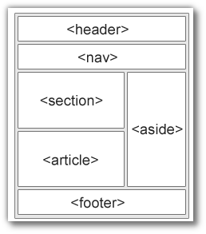

name: default-page
layout: true
background-image: url("fablabsp_icon_100px.png")
background-position: 98% 2%

---

class: center, middle

# EP1000<br>CSS

---
template: default-page
layout: false

# (more) HTML

- Before we can get to CSS, we need to cover a little more HTML

## Review

- HTML is for .highlight[CONTENT]

- CSS is for .highlight[LAYOUT]

Often we "break-up" a page into sections

 - easier management
 - generating a template
 - duplicating pages, changing only relevant sections

---
template: default-page
layout: false

# The Head Element

- the HTML &lt;head&gt; element is a container for 
  - &lt;title&gt;
  - &lt;link&gt;
  - &lt;style&gt;
  - &lt;script&gt;
  - &lt;meta&gt;
- contains .highlight[metadata] (data about the HTML document)
- Metadata is not displayed.

---
template: default-page
layout: false

# The Head Element (contd)

## &lt;title&gt;

- text which is displayed on the browser's bar or page's tab
- .highlight[required] in HTML documents
- purpose
  - defines a title in the browser's toolbar
  - provides a title for the page when added to favorites
  - displays a title for page in search engine results.


### &lt;link&gt;

- defines the relationship between current document and an external resource.
- most often used to link external style sheets

```html
<link rel="stylesheet" href="mystyles.css"
```

---
template: default-page
layout: false

# The Head Element (contd)

## &lt;style&gt;

- used to define style information for a .highlight[SINGLE] HTML page.


## &lt;script&gt;

- used to define client-side Javascripts


## &lt;meta&gt;

- used to provide information about the page.
- used by browser to decide how to reload/render the page
- used by search engines to define keywords and content


---
template: default-page
layout: false

# Block and Inline

## Block-level Elements

- Starts on a new line
- Takes up full width available
- Has top and bottom margin
- [Example](https://www.w3schools.com/html/html_blocks.asp)
  - &lt;div&gt; used as a container

## Inline Elements

- Does not start on a new line
- Takes up as much space as necessary
- cannot contain a block-level element
- [Example](https://www.w3schools.com/html/html_blocks.asp):
  - &lt;span&gt; used to mark up a block of text

---
template: default-page
layout: false

# Layout Elements and Techniques

.left-column-50[
- uses a kind-of &lt;div&gt;
- [Semantic elements]((https://www.w3schools.com/html/html5_semantic_elements.asp)) that define the different parts of a web page
  - header
  - nav
  - section
  - article
  - aside
  - footer
- Clearly describes its meaning to both the browser and developer
- Layout techniques:
  - CSS framework
  - [CSS float](https://www.w3schools.com/css/css_float.asp) property
  - CSS flexbox
  - CSS grid
]

.right-column-50[

]

<div style="clear:both">
For simplicity we will only use the .highlight[float] property.
</div>

---
template: default-page
layout: false

# Typical Project Page

.left-column-20[
- Can you break down the blocks?
- Can you name them?
- How about the layout?
]

.right-column-70[<a href="project_layout.png" target="_blank" >Project Layout</a>]

---
template: default-page
layout: false

# Typical Project Page Breakdown

.left-column-60[
```html
<body>
    <header>
        <h1>My Project Site</h1>
    </header>
    <nav>
        <p>Navigation: </p>
        <ul>
            <li><a href="">Main</a></li>
            <li><a href="">Projects</a></li>
        </ul>
    </nav>
    <div>
        <h2>Welcome</h2>
        <p>Lorem ipsum, dolor, sit amet consectetur adipisicing elit. Impedit, incidunt.</p>
    </div>
    <div style="float:left; width:49%">
        
    </div>
    <div style="float:right; width:49%">
        <p>Lorem ipsum dolor sit amet consectetur adipisicing necessitatibus. Nam eaque officia, distinctio molestiae?</p>
    </div>
    <div style="clear:both">
        <h2>What we cover</h2>
        <p>Lorem ipsum dolor sit amet consectetur adipisicing /p>
    </div>
    <footer>
        <p>Copyright</p>
    </footer>
</body>
</html>
```
]

.right-column-40[
<a href="project_div.png" target="_blank"></a>
]


---
class: center, middle

# EP1000<br>HTML

### .red[End]

