name: default-page
layout: true
background-image: url("fablabsp_icon_100px.png")
background-position: 98% 2%

---

class: center, middle

# EP1000<br>GIT & GITHUB


---
name: Git & Github
template: default-page
layout: false
# Git & Github

## Git

- A software for tracking changes in any set of files.
- Implements Version Control over distributed networks.
- Most widely used modern VCS.
- Free and open-source software distributed under GNU.

## Github

- A provider for Internet hosting for software development.
- Uses Git plus its own features
- Offers basic services free of charge.
- The largest repository of public domain software development.

<!-- /Git & Github -->

---
name: GitHub
template: default-page
layout: false
# GitHub

### [Github](https://github.com)

- A website and cloud-based service that allows developers to store and manage their code, as well as track changes to their code.
- Allows you to host public accessible static web-pages.

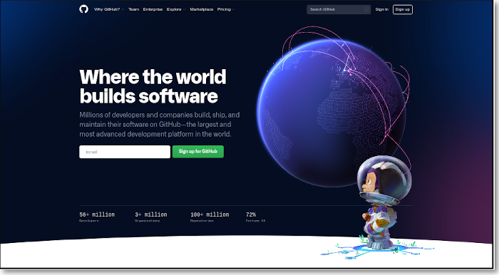

<!-- /GitHub -->

---
name: Create an Account
template: default-page
layout: false
# Create an Account

### Signup for Github

- Use your email (Personal/permanent)
- Select a password (min 6 characters/digits)
- Confirm your account using email

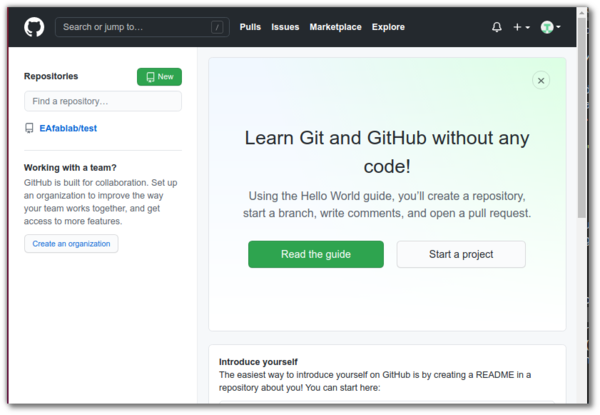

<!-- /Create an Account -->

---
name: Project/Repository
template: default-page
layout: false
# Project/Repository

.right-column-40[###Repository

A .highlight[repository] is a project space.

You can make as many<br>repositories as you like.

- Create a repository
- Give it a name
- Needs to be Public
- Add a README
- Give it a license

You can now add files to the repository.
]

.left-column-60[<a href="create_repository.png">
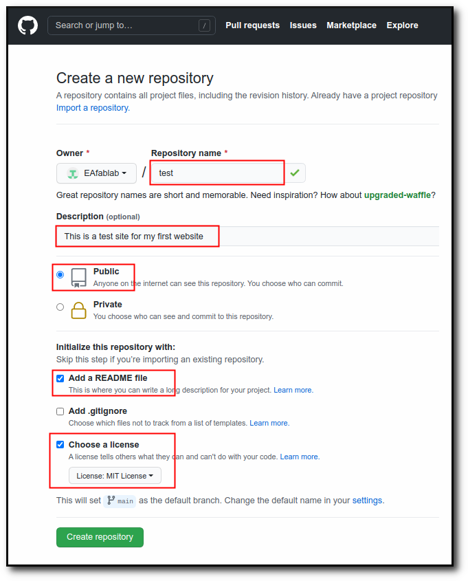
</a>
]
<!-- /Project/Repository -->

---
name: Your Repository
template: default-page
layout: false
# Your Repository

<a href="test_repository.png" alt="test repository">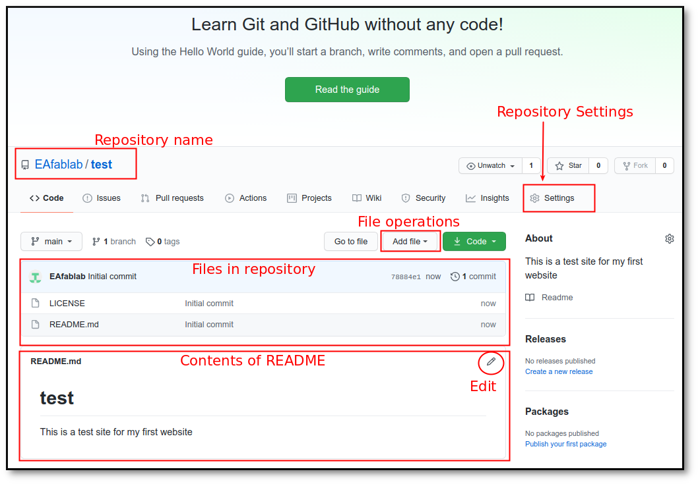</a>

.footnote[Upload your website to this repository]

<!-- /Your Repository -->

---
name: GitHub Pages
template: default-page
layout: false
# GitHub Pages

.left-column-60[
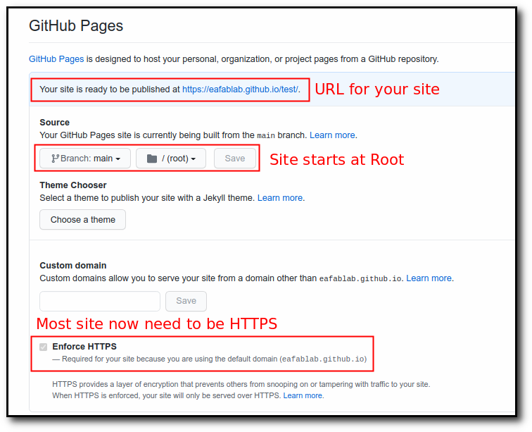
]

.right-column-40[### Settings
- Scroll down until yout see .highlight[GitHub pages]
- Allows you to host this repository as a website
- Select branch as .blue[Main]

Note down your .highlight[URL].

Eg. https://.highlight[username].gitub.io/test
]

<!-- /GitHub Pages -->

---
name: ReCap
template: default-page
layout: false
# ReCap

## Github account

Your github account is https://github.com/.highlight[username]

## Github repository

Each project is stored in a .highlight[repository].

The repositories are located in your Github account.

## Github pages

You can convert a repository into a web-site.

- requires setting in your Github account.
- requires an .highlight[index.html] as the start/main page.
- link your pages from the main page.
- only .highlight[static] web pages are supported.

Your github page is https://.highlight[username].github.io/.highlight[repository]

<!-- /ReCap -->

---
name: Git
template: default-page
layout: false
# 

- A software for tracking changes in any set of files.
- Implements Version Control over distributed networks.
- Most widely used modern VCS.
- Free and open-source software distributed under GNU.

### Advantages of learning Git

- Now a requirement for software developers
- Can use git to keep track of your own software projects
- Cross-platform
- Usually implemented as a .highlight[COMMAND LINE INTERFACE]
- Windows/Mac have Github Desktop implementations.

### Installation

- [Git site](https://git-scm.com/) for downloads and installations
- GUI version ([Windows10](https://desktop.github.com/), [Mac](https://central.github.com/deployments/desktop/desktop/latest/darwin))
- Reference Book: [Pro Git](https://git-scm.com/book/en/v2) book
- Tutorial: YouTube [Git Crash Course](https://youtu.be/SWYqp7iY_Tc) by Brad Traversy, TraversyMedia.com

<!-- /git -->

---
name: Git Workflow & Commands
template: default-page
layout: false
# Git Workflow & Commands

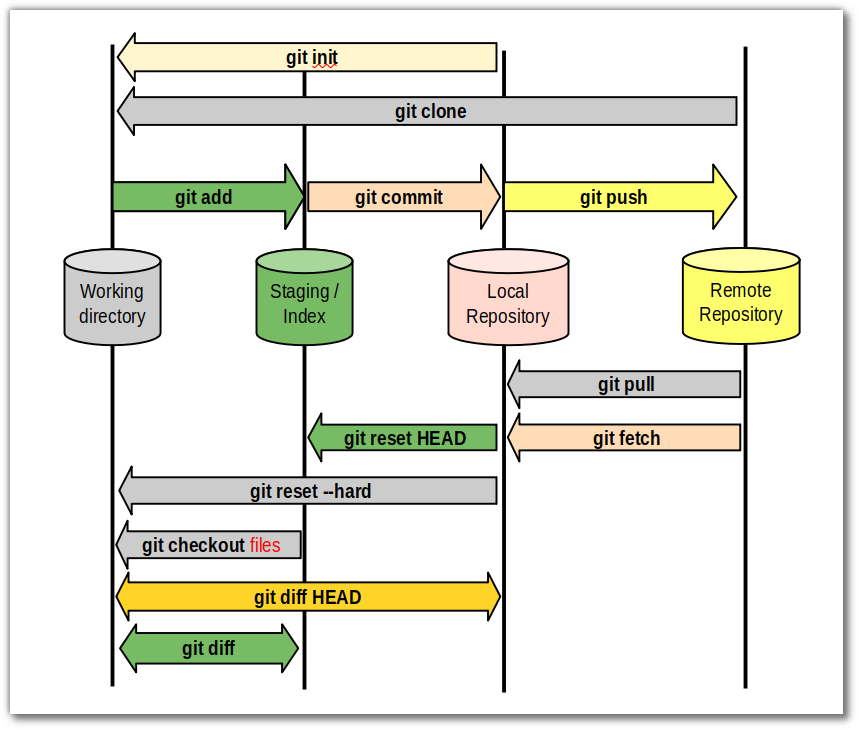

<!-- /Git Workflow & Commands -->

---
name: Configure Git
template: default-page
layout: false
# Configure Git

```bash

$ git config --global user.name "Rodney Dorville"

$ git config --global user.email "rdorville@dont.mailme.com"

 

```

### Configuration

- Enter your git-password to authorise the operations.
- Using the CLI, you can use .highlight[https] or .highlight[ssh].
- You can also use public/private keys.

<!-- /Configure Git -->

---
name: Git init / clone
template: default-page
layout: false
# git init / clone

## git init

- Initialises a new repository (locally)
- Created in a folder (.highlight[.git]) in the current directory
- Repository is clean, empty.

.left-column-50[## git clone {URL}

- .highlight[Clones] (makes an exact copy) of a remote repository.
- Easiest way to start a repository.
- initialises the local repository before copying the files.
- Any public repository (from Github) can be cloned.
]

.right-column-50[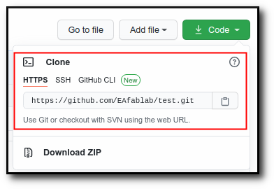]

<!-- /Git init / clone -->

---
name: Working on GitHub
template: default-page
layout: false
# Working on GitHub

1. First create the repository on GitHub e.g. testsite
2. Obtain the URL from the .highlight[clone] link.
3. Clone the repository
  - download the Zip file, extract the contents in the folder
  - use git clone {url}
  - use the gui desktop (later)
4. the name of the folder is the name of the repository.

```bash
$ git clone https://github.com/rdorville/testsite.git

Cloning into 'testsite'...
remote: Enumerating objects: 4, done.
remote: Counting objects: 100% (4/4), done.
remote: Compressing objects: 100% (3/3), done.
remote: Total 4 (delta 0), reused 0 (delta 0), pack-reused 0
Unpacking objects: 100% (4/4), done.

$ cd testsite
$ ls -l

total 8
-rw-rw-r-- 1 rodney rodney 1072 May  5 01:21 LICENSE
-rw-rw-r-- 1 rodney rodney   31 May  5 01:21 README.md

```


<!-- /Working on GitHub -->
---
name: First Update to Remote
template: default-page
layout: false
# First Update to Remote

1. Copy your files into the repository folder
2. .highlight[git add .] to add the files to the index (works recursively)
3. .highlight[git commit] records changes to the local repository
4. .highlight[git push] updates the remote repository with the changes.

This is usually your typical workflow to record changes.

```bash
$ git add .
$ git commit -m "First push"
[main 9e6ace6] First push
 2 files changed, 97 insertions(+)
 create mode 100644 index.html
 create mode 100644 style.css

$ git push
Username for 'https://github.com': rdorville@do.not.mail.me
Password for 'https://roddorville@gmail.com@github.com': 
Counting objects: 4, done.
Delta compression using up to 4 threads.
Compressing objects: 100% (4/4), done.
Writing objects: 100% (4/4), 1.36 KiB | 1.36 MiB/s, done.
Total 4 (delta 0), reused 0 (delta 0)
remote: This repository moved. Please use the new location:
remote:   https://github.com/RDorville/testsite.git
To https://github.com/rdorville/testsite.git
   00a1464..9e6ace6  main -> main
$
```
<!-- /First Update to Remote -->

---
name: Working with Others
template: default-page
layout: false
# Working with Others

What happens when more than one person works on the project?
What happens when you have more than one workstation (e.g. home, work, laptop)

- The remote repository may have changed.
- Hence, sync your local repository before you work

```bash
$ git pull
Already up to date.
```

or, when you have changes

```bash
$ git pull
remote: Enumerating objects: 4, done.
remote: Counting objects: 100% (4/4), done.
remote: Compressing objects: 100% (3/3), done.
remote: Total 3 (delta 1), reused 0 (delta 0), pack-reused 0
Unpacking objects: 100% (3/3), done.
From https://github.com/rdorville/testsite
   9e6ace6..971441d  main       -> origin/main
Updating 9e6ace6..971441d
Fast-forward
 definition.png | Bin 0 -> 68727 bytes
 1 file changed, 0 insertions(+), 0 deletions(-)
 create mode 100644 definition.png

$
```
<!-- /Working with Others -->

---
name: Oops! I deleted a file!
template: default-page
layout: false
# Oops! I deleted a file!

### How do you recover your missing file?

- git stores the changes in the local repository
- to retrieve previous versions, do a .highlight[git checkout]

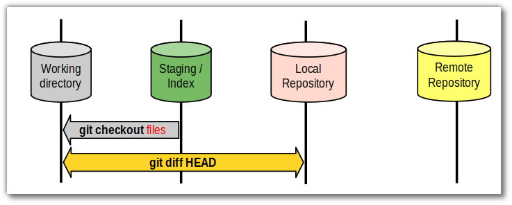

### Which file?

- .highlight[git log] shows your history
- you can recover your work at any point.
- file is identified by its .highlight[hash] (checksum)

<!-- /Oops! I deleted a file! -->

---
name: Good! I've fixed it!
template: default-page
layout: false
# Good!  &nbsp;   I've fixed it!

### Try something new

- Split or .highlight[git branch] the original idea to start something new
- Make changes to the original project (while keeping the original code)
- Try different ideas simultaneously for your project

### .highlight[HELP!]

- try Google first
- watch a few tutorials
- there's always [Pro Git]()
- try this:
  - move your local files to another folder
  - re-clone the project/repository
  - recover your local vs remote changes manually

<!-- /Good! I've fixed it! -->

---
name: GitHub Desktop
template: default-page
layout: false
# GitHub Desktop

### Sign in

- Check that credentials are correct
- Check the email and user name is correct
- You will be asked by Github to login and verify

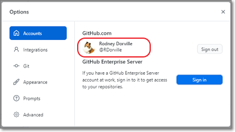

.footnote[.highlight[git config] to register your credentials]

<!-- /GitHub Desktop -->


---
name: Create Your Repository
template: default-page
layout: false
# Create Your Repository

.left-column-50[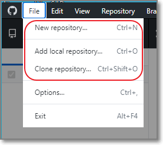]

.right-column-50[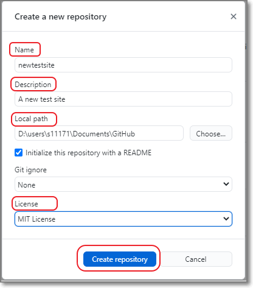]

.clearfix[&nbsp;]


.footnote[.highlight[git init / clone]]

<!-- /Create Your Repository -->

---
name: First Commit
template: default-page
layout: false
# First Commit

.left-column-40[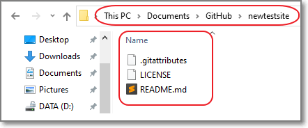]

.right-column-60[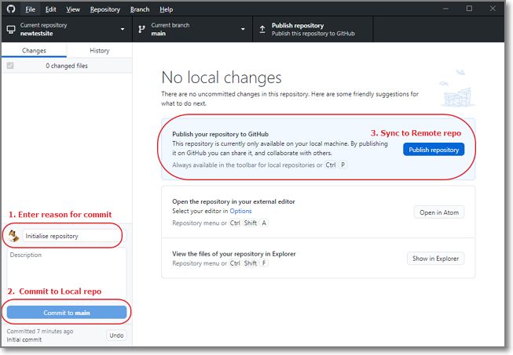]

.clearfix[&nbsp;]

.footnote[.highlight[git add ; git commit -m ; git push]]

<!-- /First Commit -->

---
name: gitHub Repository
template: default-page
layout: false
# gitHub Repository

Contents of GitHub Repository

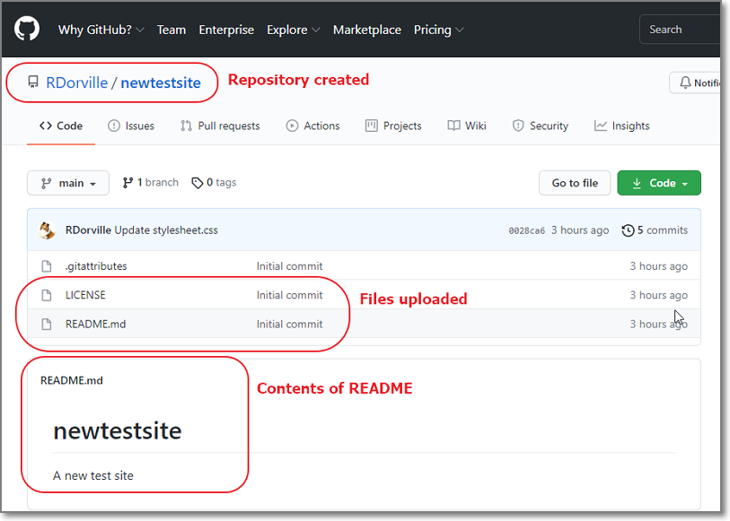

<!-- /gitHub Repository -->


---
name: Add File
template: default-page
layout: false
# Add File(s)

.left-column-30[- Add/Create new files
- Save to your Local Repository
- (or) Sync to your Remote repository]

.right-column-70[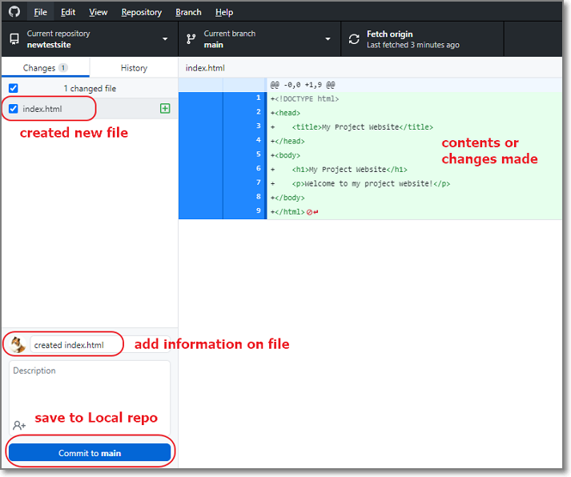]

.clearfix[&nbsp;]

.footnote[.highlight[git add], .highlight[git commit -m], and .highlight[git push]]

<!-- /Add File -->


---
name: What has changed?
template: default-page
layout: false
# What has changed?

- Shows which files have changed since the last commit

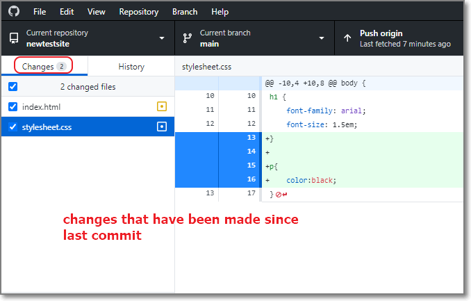

.footnote[.highlight[git status]]

<!-- /What has changed? -->


---
name: What Has Been Done So Far?
template: default-page
layout: false
# What Has Been Done So Far?

- Shows the history of the repository (since conception)

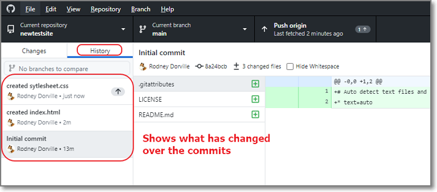

.footnote[.highlight[git log]]

<!-- /What Has Been Done So Far? -->


---
name: Restore Old Files
template: default-page
layout: false
# Restore Old Files

- Restore the files you were previously working on
- Rolls back history

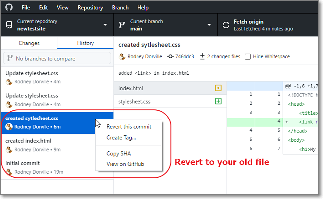

.footnote[.highlight[git checkout]]

<!-- /Recover Old Files -->

---
name: Marked Assignment (..3)
template: default-page
layout: false
# Marked Assignment (..3)

# Final Part

- Create a GitHub Repository .highlight[EP1000]
- Move your project website into this repository.
- Convert the repository into GitHub pages

## Submission

- Open https://tinyurl.com/ep1000sites (EP1000-Y21S01-01-Documentation)
- Next to your name, enter the URL of your Project Documentation Site
- This site will be used for marking.
  - You will need to maintain and update your site
  - Please .highlight[ENSURE] that the site works.
- First deadline: .highlight[2 Weeks] from this class

## Problems

- Telegram-message the Class Group

<!-- /Assignment  -->
---
class: center, middle

# EP1000<br>git & gitHub

### .red[End]

