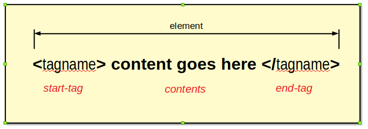
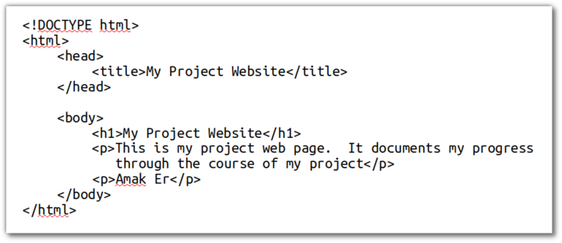
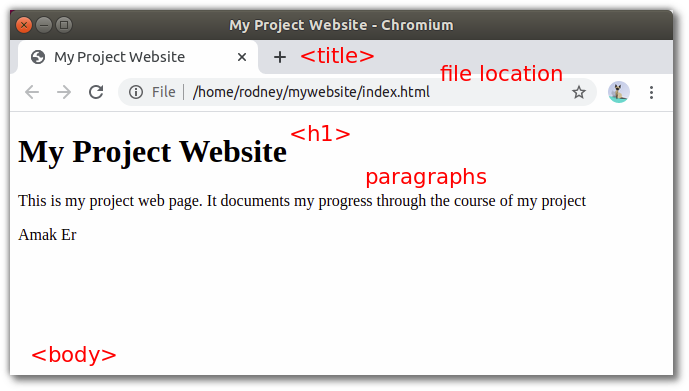
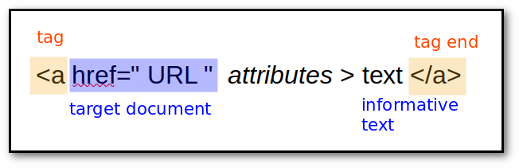
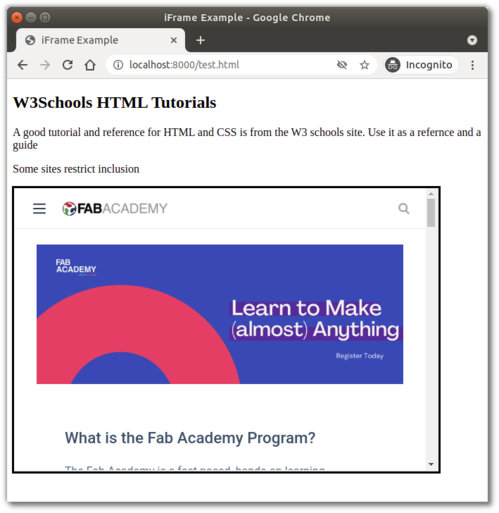
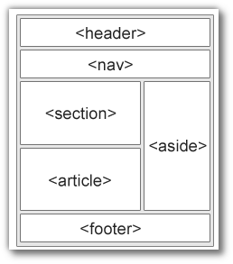

name: default-page
layout: true
background-image: url("fablabsp_icon_100px.png")
background-position: 98% 2%

---

class: center, middle

# EP1000<br>HTML


---

template: default-page
layout: false

# Hypertext Markup Language

HTML is the standard markup language for createing Web pages.

- HTML describes the structure of a Web page
- HTML consists of a series of elements
  + Each element has a start and end tag
  + Each element has content
- Elements tell the browser how to display the content
- HTML define .highlight[CONTENT].




Ref:
- [W3 Schools HTML tutorial](https://www.w3schools.com/html/html_intro.asp)
- [W3 Schools HTML reference](https://www.w3schools.com/tags/default.asp)

---

template: default-page
layout: false

# Web Page

## Structure

```html
<!DOCTYPE html>
<html>
  <head>
    <title>My Web Page</title>
  </head>
  <body>
    <h1>My Project Web Page</h1>
  
    <p>This is my project web page.  It documents my progress through the 
    course of my project</p>
    <p>Amak Er</p>

  </body>
</html>
```
- Use a .highlight[folder] to hold the contents of your website.
- The starting page of your website is name .highlight[index.html].
- All webpages have the default extension HTML
- The website is uploaded to a Web Server, which hosts the pages.

---
template: default-page
layout: false

# Structure



- .highlight[!DOCTYPE html] identifies this as a HTMLv5 document.
- the &lt;html&gt; &lt;/html&gt; tags show the content of the page.
- the content is made up of a .highlight[head] and a .highlight[body]
- the head section has 
    - a title which identifies the page
- the body section, has the bulk of the content
    - has a heading (bold large text)
    - has paragraphs of text

---
template: default-page
layout: false

# Rendered by a Browser

Drag and Drop your file (index.html) on a browser windor



You web browser will convert (.highlight[render]) the contents.

This includes text, images, audio and video.

---
template: default-page
layout: false

# Build your first Website

1. Create a folder .highlight[mywebsite]
2. Create a file .highlight[index.html] within the folder.
3. Edit and enter the contents of a basic web-page.
4. Save your file and display it on the browser.

&nbsp;

## Tips (especially for .highlight[Windows] users)

- use a Pure Text Editor (.highlight[NOT] notepad)
- turn .highlight[ON] file extensions viewing in Explorer.
- create a folder for your website, this is called the .highlight[root] folder.
- the starting file must be named .highlight[index.html]
- name all your files in .highlight[lowercase]
- do .highlight[NOT] use spaces in the filenames.
- keep all your files in the same folder (you can have sub-folders)
- file location is .highlight[relative] to this root folder


---
template: default-page
layout: false

# Learning HTML

- You will need to understand and know how to use .highlight[BASIC] HTML.
- We .highlight[don't expect] you to be experts.

## A list of what you need to learn

- [Elements](https://www.w3schools.com/html/html_elements.asp)
- [Attributes](https://www.w3schools.com/html/html_attributes.asp)
- [Headings](https://www.w3schools.com/html/html_headings.asp)
- [Paragraphs](https://www.w3schools.com/html/html_paragraphs.asp)
- [Style](https://www.w3schools.com/html/html_styles.asp)
- [Formatting](https://www.w3schools.com/html/html_formatting.asp)
- [Colors](https://www.w3schools.com/html/html_colors.asp)
- [Comments](https://www.w3schools.com/html/html_comments.asp)
- [Images](https://www.w3schools.com/html/html_images.asp)
- [Lists](https://www.w3schools.com/html/html_lists.asp)
- [Bookmarks](https://www.w3schools.com/html/html_links_bookmarks.asp)
- [Links](https://www.w3schools.com/html/html_links.asp)
- [Tables](https://www.w3schools.com/html/html_tables.asp)
- [Layouts](https://www.w3schools.com/html/html_layout.asp)

---
template: default-page
layout: false

# Headings and Paragraphs

## Headings

- Headings are used as titles or sub-titles on the webpage
- Keep .highlight[H1] as the title of the page.
- Use .highligh[H2] and .highligh[H3] for your sub-headings/titles
- Limit your headings up to 3-levels.

## Paragraphs

- Paragraphs are used to define text.
- Paragraphs makes text appear on a new line.
- White space is ignored in paragraphs.
- .highlight[Remember] to start and end your paragraphs with the .bold[&lt;p&gt;] tags.
- special tags/[characters](https://www.html.am/reference/html-special-characters.cfm):
  - &amp;nbsp; non-breaking white space
  - &lt;br&gt;  line-break
  - special characters: &amp;amp; (&amp;), &amp;lt; (&amp;), gt; (&gt;), &amp;copy; (&copy;)
  - &lt;pre&gt; pre-formatted text

---
template: default-page
layout: false

# Styles

- the &lt;style&gt; attribute is used to add styles your elements.
- you can change color, font, size, and more.
- we will use .highlight[CSS] to apply styles 

## Inline Styles

- styles can also be applied inline (for a particular element)
- however,
  - leads to confusing web-sites
  - only used as a quick-patch solution

```html
  <h1 style="color:blue;">This is a heading</h1>

  <p style="color:red;">This is a red paragraph.</p>
  <p style="text-align: center">This is a center-aligned paragraph</p>
```

- more on styles, when we work on CSS.

---
template: default-page
layout: false

# Formatting

- You can format your text to emphasize what your intentions.
- Here is a short list of formatting elements
  - &lt;b&gt; - Bold text
  - &lt;i&gt; - Italic text
  - &lt;em&gt; - Emphasized text
  - &lt;strong&gt; - Important text
  - &lt;small&gt; - Smaller text
  - &lt;del&gt; - Deleted text
  - &lt;ins&gt; - Inserted text
  - &lt;mark&gt; - Marked text
  - &lt;sub&gt; - Subscript text
  - &lt;sup&gt; - Superscript text


  ## Colors

  - You can also manipulate the colors of your elements
  - More elaborate explanation can be found [here](https://www.w3schools.com/html/html_colors.asp)

---
template: default-page
layout: false

# Comments

- Comments help in putting messages in your code to help you document your work.
- Comments are also used to block out code for experimentation/debugging.
- Comments are not displayed/rendered by the browser.
- You can read more [here](https://www.w3schools.com/html/html_comments.asp).


  ```html
  <!-- You can have a comment on a single line -->

  <p>Or have it on a block as in the next section.</p>

  <!--
      This is a comment
      All text is ignored between the starting and ending
      elements.
  -->
  ```

---
template: default-page
layout: false

# Images

- You can display images on a web page using the &lt;img&gt; tag.
- Images are .highlight[linked] to the web page using the &lt;img&gt; tag.
- The &lt;img&gt; tag has the end-tag as /&gt;
- The &lt;img&gt; has two required attributes
  - the .highlight[src] which references the image
  - the .highlight[alt] which provides a text explanation

```html
  
  <p>How I look</p>

  
  <p>SP Lab Fab image on the SP website</p>
```

- If your images are too large (or small), you can format them
- I suggest you use the inline-style attribute
- You can specify both width and height.
- However, if you only specify one, then the aspect ratio is kept

```html
  
  <p>Resized landscape view</p>
```

- The following images are accepted: .jpg, .png, .gif, .ico, .jpeg, .svg


---
template: default-page
layout: false

# Hyperlinks

- The true power of the WWW is hyperlinks.
- Links allow pages to be connected together.
- When you click on a link, you can "jump" to another document.
- A link .highlight[DOES NOT] need to be text!



```html
  <p>Here is a link to  <a href="https://www.w3schools.com">W3Schools</a></p>

  <p>A good option is to open the link on a new page, for example</p>
  <p>Search in a new window:<a href="https://www.google.com">Google</a></p>
```

---
template: default-page
layout: false

# Absolute and Relative URLs

- Absolute URLs have the full (absolute) URL address in the link
- Usually link to documents outside of the site

```html
  <p>You can get more information at 
  <a href="https://www.w3schools.com/html/html_links.asp">W3Schools HTML Links</a> 
  tutorial page.
```

- Relative URLs are used for documents within the site
- For example, if images are kept within a sub-folder 

```html
  <p>You can see an 
     <a href="images/picture.jpg">IMAGE</a> of the object.</p>
```

- Links are not limited to text, but to other objects as well!

```html
    <a href="images/portrait.jpg">
      
    </a><br>
    <p>You can click on the image to enlarge.</p>
```

---
template: default-page
layout: false

# HTML File Paths

- Examples

<table id="mytable">
    <tr>
        <th>Path</th>
        <th>Description</th>
        <tr>
            <td>&lt;a href="example.html" &gt;</td>
            <td>'example.html' is located in the same folder</td>
        </tr>
        <tr>
            <td>&lt;a href="files/example.html" &gt;</td>
            <td>'example.html' is located in the sub-folder 'files'</td>
        </tr>
        <tr>
            <td>&lt;a href="/example.html" &gt;</td>
            <td>'example.html' is located in  the root folder of current web</td>
        </tr>
        <tr>
            <td>&lt;a href="../example.html" &gt;</td>
            <td>'example.html' is in the folder one level up from the current folder</td>
        </tr>
        <tr>
            <td>&lt;a href="https:/tinyurl.com/example.html" &gt;</td>
            <td>absolute path<br>'example.html' is in the website https://tinyurl.com/</td>
        </tr>
    </tr>
</table>

- applies to &lt;img&gt; as well


---
template: default-page
layout: false

# Lists

- Lists are used to organise information in groups.
- There are two types of lists:


---
template: default-page
layout: false

# Lists

- Lists can be nested
- Unordered lists use the .highlight[&lt;ul&gt;] tag.

```html
  <ul>
      <li>Item #1</li>
      <li>Item #2</li>
      <li>Item #3</li>
  </ul>
```

- Ordered lists use the .highlight[&lt;ol&gt;] tag

```html
  <ol>
      <li>Item #1</li>
      <li>Item #2</li>
      <li>Item #3</li>
  </ol>
```

- In both cases, list items are tagged using .highlight[&lt;li&gt;]

---
template: default-page
layout: false

# Tables

- Tables allow you to organise your information in rows and columns.
- Limit the sizes of your tables, as the browser needs to load the .highlight[table] before it can be rendered.

<table id="mytable">
    <tr>
        <th>Tag</th>
        <th>Purpose</th>
    </tr>
    <tr>
        <td>&lt;table&gt;</td>
        <td>Defines a table</td>
    </tr>
    <tr>
        <td>&lt;tr&gt;</td>
        <td>Defines a row in the table<br>
          You can have one or many rows
        </td>
    </tr>
    <tr>
        <td>&lt;th&gt;</td>
        <td>Defines a header column<br>
          There is only 1 header row, but can have many columns
        </td>
    </tr>
    <tr>
        <td>&lt;td&gt;</td>
        <td>Defines a column in a row<br>
          You can have many columns in a row
        </td>
    </tr>
</table>

- More on tables at [W3Schools](https://www.w3schools.com/html/html_tables.asp)
- Alternatively, you can use a [table generator](https://www.tablesgenerator.com/)

---
template: default-page
layout: false

# About Page

- Every site has an .highlight[About] page
- The about page informs the reader about the author/purpose of the site.

## Task

1. Create an About page, which is linked from the main page (index.html)
2. Write one or two paragraphs informing the reader about the purpose of this site.
3. Use a table with two columns, to show
  - A selfie of the author (on the left)
  - Some information about the author (on the right)
4. Provides some means of contacting the author
5. Have links that can return to the main page

**Extra Credit**
- Store your images in a folder named "images"
- Images is located as a sub-folder to the root of the site.

---
template: default-page
layout: false

# The Head Element

- the HTML &lt;head&gt; element is a container for 
  - &lt;title&gt;
  - &lt;link&gt;
  - &lt;style&gt;
  - &lt;script&gt;
  - &lt;meta&gt;
- contains .highlight[metadata] (data about the HTML document)
- Metadata is not displayed.

---
template: default-page
layout: false

## &lt;title&gt;

- text which is displayed on the browser's bar or page's tab
- .highlight[required] in HTML documents
- purpose
  - defines a title in the browser's toolbar
  - provides a title for the page when added to favorites
  - displays a title for page in search engine results.


### &lt;link&gt;

- defines the relationship between current document and an external resource.
- most often used to link external style sheets

```html
<link rel="stylesheet" href="mystyles.css"
```

---
template: default-page
layout: false

## &lt;style&gt;

- used to define style information for a .highlight[SINGLE] HTML page.


## &lt;script&gt;

- used to define client-side Javascripts


## &lt;meta&gt;

- used to provide information about the page.
- used by browser to decide how to reload/render the page
- used by search engines to define keywords and content

---
template: default-page
layout: false

# iframe Element

.left-column-50[
- Used to display a webpage within a web page.
- You will use it to display your Fusion 360 drawings

```html
   <iframe 
       src="http://fabacademy.org/" 
       frameborder="2" 
       width="600px" height="400px" 
       title="Fabacademy.org" >
    </iframe>
```
]

.right-column-50[

]

---
template: default-page
layout: false

# Block and Inline

## Block-level Elements

- Starts on a new line
- Takes up full width available
- Has top and bottom margin
- [Example](https://www.w3schools.com/html/html_blocks.asp)
  - &lt;div&gt; used as a container

## Inline Elements

- Does not start on a new line
- Takes up as much space as necessary
- cannot contain a block-level element
- [Example](https://www.w3schools.com/html/html_blocks.asp):
  - &lt;span&gt; used to mark up a block of text

---
template: default-page
layout: false

# Layout Elements and Techniques

.left-column-50[
- uses a kind-of &lt;div&gt;
- [Semantic elements]((https://www.w3schools.com/html/html5_semantic_elements.asp)) that define the different parts of a web page
  - header
  - nav
  - section
  - article
  - aside
  - footer
- Clearly describes its meaning to both the browser and developer
- Layout techniques:
  - CSS framework
  - [CSS float](https://www.w3schools.com/css/css_float.asp) property
  - CSS flexbox
  - CSS grid
]

.right-column-50[

]

<div style="clear:both">
For simplicity we will only use the .highlight[float] property.
</div>


---
class: center, middle

# EP1000<br>HTML

### .red[End]

