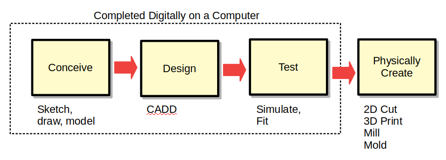
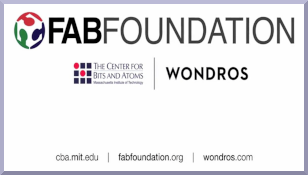
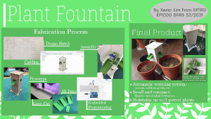
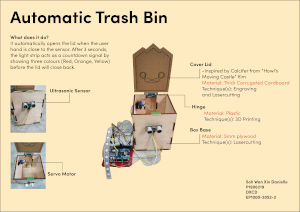

name: default-page
layout: true
background-image: url("fablabsp_icon_100px.png")
background-position: 98% 2%

---

class: center, middle

# EP1000 Digital Fabrication Prototyping Fundamentals

### Introduction

---

template: default-page
layout: false

# Presented by:

&nbsp;

&nbsp;

## Rodney Dorville (Fablab SP)

&nbsp;

| Contact    | Details         |
|:-----      |:------     |
| Email     | Rodney_Dorville@sp.edu.sg |
| Telegram Messenger: | @RodneyD_SG    |
| Office Tel: | 6772 1451   |

&nbsp;

## Site: [rdorville.github.io/EP1000](https://rdorville.github.io/EP1000)

---

template: default-page
layout: false

# Digital Fabrication

- Learn how to use Digital Fabrication techniques:

    + Computer Aided Design

    + 3D printing processes

    + Laser Cutting

- Embedded controllers - sensing & actuation

- Covert your design into a working prototype

- Document and present your prototype

---
template: default-page
layout: false

# Definition

- [Digital modeling](https://en.wikipedia.org/wiki/Digital_modeling_and_fabrication) and fabrication is a design and production process that uses digital information as its source.  
(Ref: [WikiPedia](https://en.wikipedia.org/wiki/Digital_modeling_and_fabrication))

 - Digital Fabrication allows you to build your object/idea on a computer and spending **minimal time** as well as expertise in creating the physical object on the actual machine.

- Workflow

---
template: default-page
layout: false

# Commercial Break

| &nbsp; | &nbsp; |
|-------|-------------|
|  | [Impact of Digital Fabrication](http://ng.cba.mit.edu/show/slide/16.08.fablabs.html) |
|  | Project: [Plant Fountain](https://plsspeccify.github.io/EP1000/prj/watersystem.html) |
|  | Project: [Automated Trash Bin](https://daniellesoh.github.io/ep1000/prj/projects.html) |

---
template: default-page
layout: false

# Method of Assessment

&nbsp;

| Item  | Code | Description       | Weightage |
|:-----:|:----:|:------------------|:-----:|
| 1     | CA1  | Safety, Documentation, Website  | 20% |
| 2     | CA2  | Digital Fabrication Skills  | 40%|
| 3     | CA3  | Summative Project   | 40% |

&nbsp;

### Assessment methods

- Worked weekly assignments

- Documentation

- Prototyped Project

---
template: default-page
layout: false

# Course Schedule Sess 21/22 Sem 1

|Week  | Date      | Topic                     | Assessments |
|:----:|:------ ---|:--------------------------|:----------  |
|1     | 19-Apr  | Introduction, Fablab Safety, Tools  | Safety Quiz |
|2     | 26-Apr  | Documentation, HTML & CSS, Website dev | |
|3     | 3-May   | Markdown, Version Control      | WebSite |
|4     | 10-May  | Computer Graphics, CAD 2D Drawing | Basic Drawing |
|5     | 17-May  | 3D Modelling - Extrusion, Revolution | |
|6     | 24-May  | 3D Printing Processes |  Chess Piece |
|7     | 31-May  | .blue[(MST)] Computer Controlled Cutting |
|8     | 7-Jun   | Vacation  | 3D Printing - Basic | |
|9     | 14-Jun  | Vacation | |
|10    | 21-Jun  | Vacation | Laser Cutting - Basic |
|11    | 28-Jun  |  Laser cutting | |
|12    | 5-Jul   | Basic Electronics, Soldering | |
|13    | 12-Jul  | Introduction to embedded controllers | Simple I/O |
|14    | 19-Jul  | Input devices - Switches, Sensors | |
|15    | 26-Jul  | Output devices - Displays, Motors | |
|16    | 2-Aug   | Module Project 1 | |
|17    | 9-Aug   | Module Project 2 | |
|18    | 16-Aug  | Final Presentations | Module Project |

---
template: default-page
layout: false

# Extra Benefits:

## Besides the grades...

- Fablab Safety Quiz

- 3D Printing Skill Certification

- Laser Cutting Skill Certification

## Allows usage of lab, equipment and materials outside of class hours.

---
class: center, middle

# Digital Fabrication: Introduction

### .red[End]

