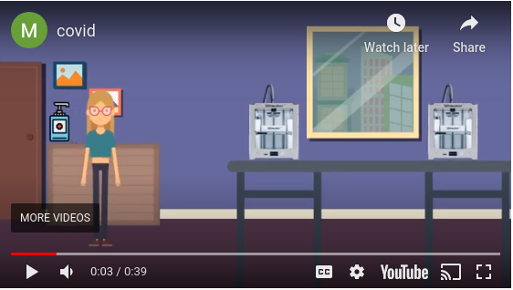
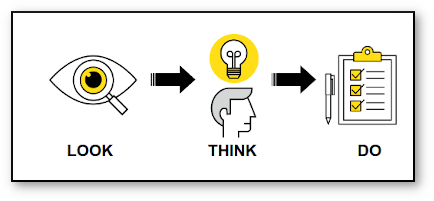
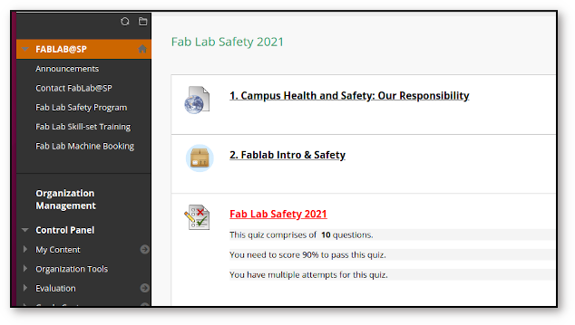
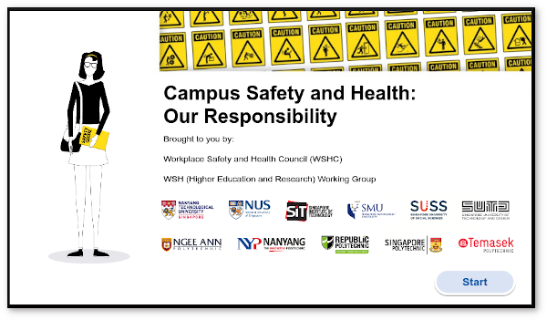
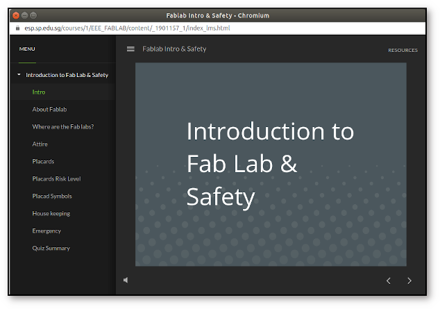

name: default-page
layout: true
background-image: url("fablabsp_icon_100px.png")
background-position: 98% 2%

---

class: center, middle

# EP1000 Fab Lab Safety

---

template: default-page
layout: false

# Safety During COVID

&nbsp;

 

&nbsp;
## Safety Issues to be observed during this period.

---

template: default-page
layout: false

# Fab Lab Safety

## Your well-being is the .blue[MOST] important issue in the lab.

## We want to create an efficient, productive and safe environment for you to work in.

## Look - Think - Do !

---
template: default-page
layout: false

# Safety Assessment

### You need to complete .blue[ALL] components

SP ESP > My Community > Fablab@SP > Fab Lab Safety 2021

---
template: default-page
layout: false

# Campus Safety and Health: Our Responsibility

### Good to review at least .blue[ONCE] a semster.

---
template: default-page
layout: false

# Fab Lab Safety

## Looks specifically at safety in SP's Fab Labs

---
template: default-page
layout: false

# Assessment

## You will now complete the Safety Assessment by

- Completing the Polytechnic Workplace Safety & Health assessment

- Read and understand Fab Lab Singapore Polytechnic .blue[**Safety Notes**]

- Complete the .blue[**Safety Assessment**] under supervision.

&nbsp;

### Inform your supervisor once you have successfully completed the assessment.

### This assessment will contribute 5% to your overall score for this module.

---
class: center, middle

# EP1000 Fab Lab Safety

### .red[End]

