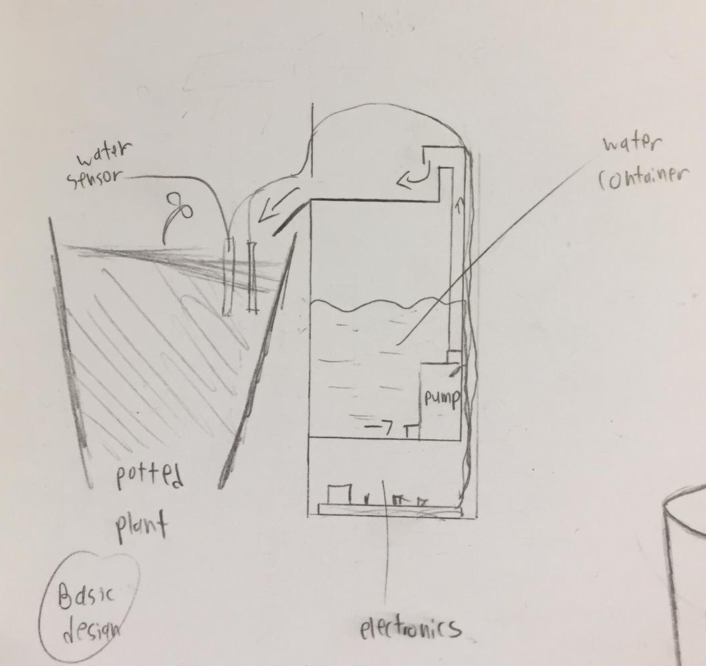
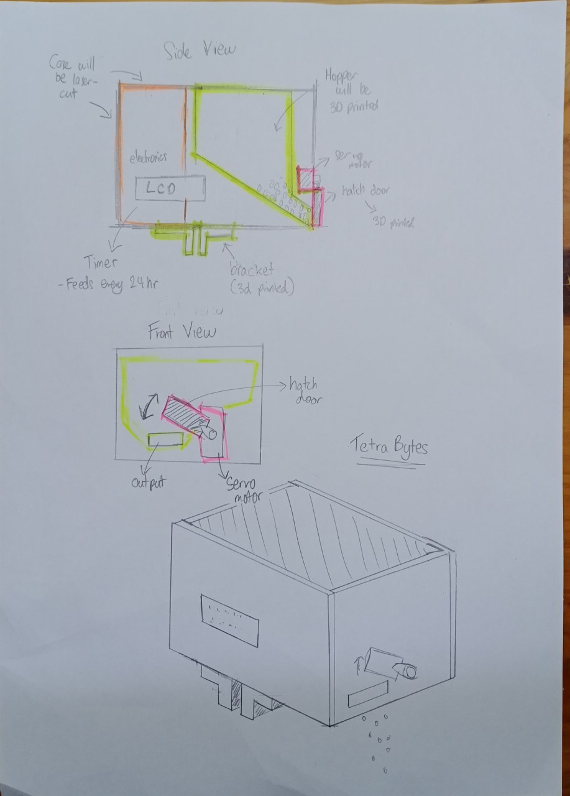

name: default-page
layout: true
background-image: url("fablabsp_icon_100px.png")
background-position: 98% 2%

---

class: center, middle

# EP1000 Tools

---

template: default-page
layout: false

# FabLab @ SP

## Operating at

- T1441~3 Engineering Academy Fab Lab

- T11C FabLab Central

- Makerspace @ Library

## Each FabLab has equipment/tools unique to its function

## All FabLabs are open to .blue[ALL] students of Singapore Polytechnic

---

template: default-page
layout: false

# Equipment

## Manual Operations

- [Simple Hand Tools](https://duckduckgo.com/?q=images%3A+hand+tool+sets&t=canonical&iax=images&ia=images)
- [Powered Hand Tools](https://duckduckgo.com/?q=images%3A+powered+tool+sets&t=canonical&iax=images&ia=images) (Drills, Saws, Sanders)
- [Foam Work](https://huphong.com.sg/product/foam-cutting-machine/hcm-2s/)
- [Acrylic Benders](https://huphong.com.sg/product/bending-machine/plastic-bending-machine/abm-500s/)

## Digital Fabrication

- [3D Printers](https://ultimaker.com/3d-printers/ultimaker-2-plus) &  [3D Scanners](https://www.3dprintingsupplier.com.au/product/handheld-sense-3d-scanner/)
- [Laser cutters](https://www.epiloglaser.com/laser-machines/fusion-laser-series.htm)
- Flatbed [cutters](https://avs.com.sg/technologies/product/cb03ii/) and [routers](http://panamech.com.my/im/versatile2500.htm)
- [3-axis Milling Routers](https://www.pdi3d.com/Roland_MDX_540_MDX_540S_MDX_540A_MDX_540SA_p/mdx-540.htm), PCB and [Small Scale Routers](https://sgtooling.com/collections/stepcraft-cnc-router/products/stepcraft-420-cnc-construction-kit-1)
- [Vacuum Formers](https://duckduckgo.com/?q=vacuum+former&t=canonical&iax=images&ia=images)
- [Mold Making and Casting](https://duckduckgo.com/?q=mold+making&t=canonical&iar=images&iax=images&ia=images)
- [Digital Embroidery Machines](https://www.brother.com.sg/en/products/all-sewing-machines/sewing-machines/pr-1050x)
- [Paper](https://www.silhouetteamerica.com/featured-product/cameo) & [Vinyl](https://global.rolanddg.com/products/vinyl-cutters/camm-1-gs-24-desktop-vinyl-cutter) Cutters
- Hobby Craft - [DyeSub Printing](https://epson.com/For-Work/Printers/Large-Format/SureColor-F570-Dye-Sublimation-Printer/p/SCF570SE), [T-Shirt Heat Press](https://duckduckgo.com/?q=heat+press+machine&t=canonical&iar=images&iax=images&ia=images), [Mug Creation](https://duckduckgo.com/?q=heat+press+mug+making+machine&t=canonical&iar=images&iax=images&ia=images), [Badge Making](https://duckduckgo.com/?q=badge+making&t=canonical&iax=images&ia=images)

---
template: default-page
layout: false

# Software Tools

## Very essential tools for the digital fabricator

## Use Open Source Tools (Cross-platform)

- Pure Text Editor - [Atom](https://atom.io/), [SublimeText3](https://www.sublimetext.com/3), [Visual Studio Code(W)](https://code.visualstudio.com/), [Notepad++(W)](https://notepad-plus-plus.org/)

- Raster Graphics - [GIMP](https://www.gimp.org/)
    - Image Resizers - [FastOne Photo Resizer(W)](https://www.faststone.org/FSResizerDownload.htm)
    - Image Capture - [PicPick(W)](https://picpick.app/en/), [Shutter(L)](https://www.cyberciti.biz/open-source/linux-screenshot-program-tool/), [SnagIt(M)](https://www.techsmith.com/screen-capture.html)

- Vector Graphics - [InkScape](https://inkscape.org/), [LibreCAD](https://librecad.org/)

- Full CAD System - [Fusion 360](https://www.autodesk.com/campaigns/education/fusion-360)

- Embedded Controller IDE - [Arduino](https://www.arduino.cc/)

- Browsers [Firefox](https://www.mozilla.org/en-US/), [Chrome](https://www.google.com/intl/en/chrome/), [Chromium](https://www.chromium.org/)

- [PortableApps](https://portableapps.com/)

---
template: default-page
layout: false

# Software Installation

### Choose your weapon!

<table id="mytable">
  <tr>
    <th>Purpose</th>
    <th>Choice</th>
    <th>Reasons</th>
  </tr>
  <tr>
    <td>Text Editor</td>
    <td> </td>
    <td> </td>
  </tr>
  <tr>
    <td>Graphics Editor</td>
    <td> </td>
    <td> </td>
  </tr>
  <tr>
    <td>Vector Editor</td>
    <td> </td>
    <td> </td>
  </tr>
  <tr>
    <td>Screen Capture</td>
    <td> </td>
    <td> </td>
  </tr>
  <tr>
    <td>Image Resizer</td>
    <td> </td>
    <td> </td>
  </tr>
  <tr>
    <td>CAD System</td>
    <td>Fusion 360</td>
    <td>Pro CAD, 3yr Education License</td>
  </tr>
  <tr>
    <td>IDE</td>
    <td> </td>
    <td> </td>
  </tr>
  <tr>
    <td>Browser</td>
    <td> </td>
    <td> </td>
  </tr>
</table>

Include this table in your documentation
 - Add to the contents, should you change
 - Keep old choices and reasons to compare

---
template: default-page
layout: false

# Learn How to Sketch

## Allows you to express your thoughts

- Need not be .blue[pretty]

- Refine your sketches as you formalise your design

- Add dimenstions to the sketches

## Sketches help in refining your digital designs

<table>
  <tr>
    <td></td>
    <td></td>
  </tr>
</table>

---
template: default-page
layout: false

# Assignment

## What will you do for your module project?

- Sketch the idea on a piece of paper

- Refine your sketches, add comments, dimensions

- Take photos of the sketches for inclusion in your reports

## Please complete before next lesson

&nbsp;

### Will you be able to build a model of the project?

### Why is building a model so early, important?

---
class: center, middle

# EP1000 Tools

### .red[End]

